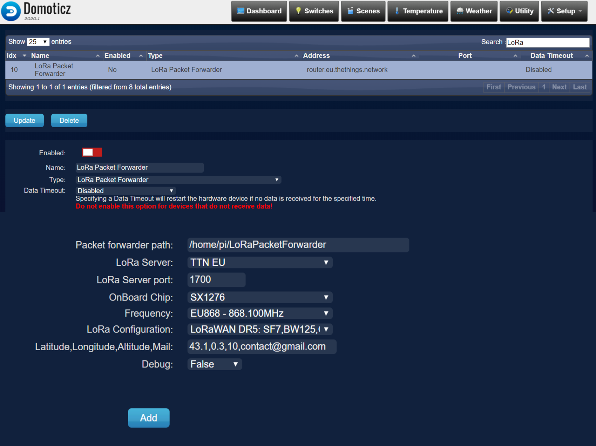
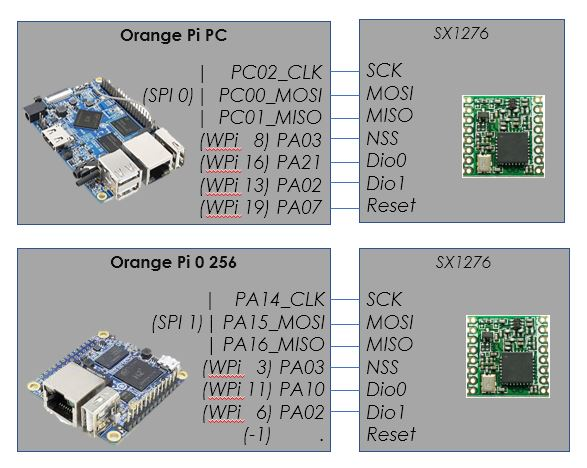
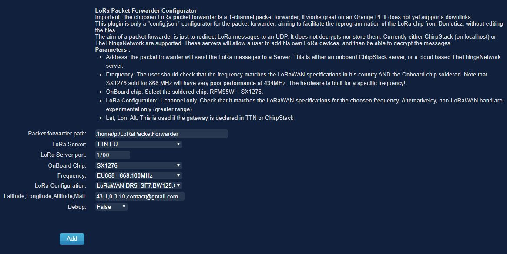
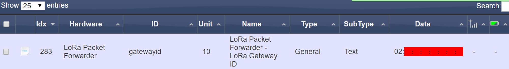

# LoRa Packet Forwarder - Domoticz Configurator

A simple Domoticz plugin to easily configure a LoRa Packet Forwarder from Domoticz

It requires an Orange Pi with Domoticz, Semtech LoRa module, and the [LoRa Packet Forwarder](https://github.com/zhgzhg/LoRaPacketForwarder) (thanks to his great work).

I guess it is not very complicated to adapt to a Raspberry Pi and another Packet Forwarder. 

### Goal : 
- Start and configure the LoRa Packet Forwarder on Orange Pi
- Allow differents Semtech chips soldered on the box 

### Concept : 
- Reconfigure the Packet forwarder for it's own LoRa devices and region (change SF, BW, frequency)
- Editing the settings will kill the LoRaPktFwrd process
- Restart the process, decode the gateway ID and the update the variable
- The heartbeat will chek that the process is still running, and if not try to restart it
- If a wrong config is put, the plugin will revert to the previous working config file

# Installation 

### Requirements : 
- Install LoRa Packet Forwarder following [this link](https://github.com/zhgzhg/LoRaPacketForwarder)
- Create and configure the first instance of the config.json 
- Compile and check "sudo /.LoRaPktFwrd" is working

       The installation tree should be the same as : 
       
           [USER PATH]=/home/pi/LoRaPacketForwarder (for example) 
           
                           [USER PATH]/config.json
                           
                           [USER PATH]/Makefile
                           
                           [USER PATH]/LoRaPktFwrd
                           
                           [USER PATH]/...
                           

- Python 3.5+ with packages : psutil, shutil

### Installation 

See [Using_Python_plugins](https://www.domoticz.com/wiki/Using_Python_plugins)

1. Clone this repository into domoticz/plugins

> cd domoticz/plugins
>
> git clone https://github.com/Di-Ny/LoRaPacketForwarderDomoticzConfigurator

2. Restart Domoticz 
3. Domoticz > Settings : "Accept new Hardware Devices"
4. Domoticz > Hardware > Find in the list "LoRa Packet Forwarder". 
5. Fill in the parameters
6. Click "Add"

### TODO :
- Waiting to add more parameters to be able to add interface (eth0, ppp0), individual inputs for Coding Rate, Lat, Lon, Alt, mail, ...
- Can be adapted to different packets forwarder with a bit of work 
